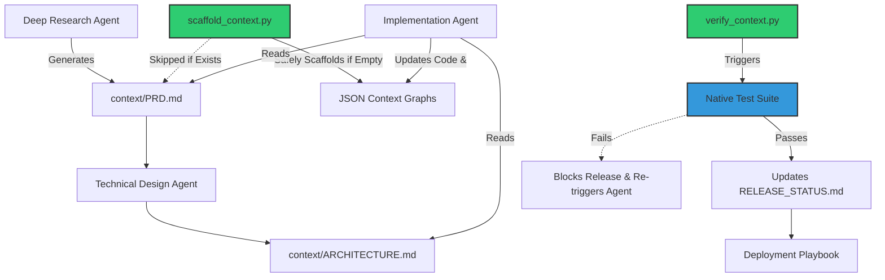

# UltimateWorkflows (ELITE Edition) 🚀

Welcome to **UltimateWorkflows**, a production-grade, state-of-the-art autonomous engineering ecosystem. This repository contains the templates, playbooks, and scaffolding scripts required to transform any standard AI coding agent into a highly resilient, context-aware Staff Engineer.

## 🌟 Why UltimateWorkflows?
Standard AI coding agents suffer from **context amnesia**, **infinite execution loops**, and **hallucinations**. UltimateWorkflows fixes this by introducing an OS-level "Context Engineering" framework that relies on persistent JSON graphs, strict execution gating, and specialized playbooks.

## 🛠️ How to Use

### 1. Initialize the Context OS
Before assigning any work to an Agent, you must scaffold the underlying Context OS. Run the initialization script from the root of your project:
```bash
python workflows/scripts/scaffold_context.py
```
*This safely generates the `context/` directory, including your `PRD.md`, `ARCHITECTURE.md`, and the foundational JSON state graphs (`BUG_GRAPH.json`, `FEATURE_GRAPH.json`).*

### 2. Instruct Your Agents
Point your AI agent (Cursor, Gemini, Copilot, Claude) to the `workflows/vibe-coding-workflows.md` file as its master instruction set. 

Based on your need, instruct the agent to utilize one of our specialized ELITE playbooks:
- ♿ **[Frontend Accessibility & UX](frontend/a11y_playbook.md)**
- 🏗️ **[Backend & Database Engineering](backend/backend_playbook.md)**
- ☁️ **[DevOps & Cloud Engineering](devops/devops_cloud_playbook.md)**
- 🏢 **[Enterprise Monorepo Orchestration](devops/monorepo_playbook.md)**
- 🔒 **[Security Audit & Code Review](security/security_audit_playbook.md)**
- 🤖 **[AI & Prompt Engineering](ai/ai_engineering_playbook.md)**
- 🧪 **[QA Automation & E2E Testing](qa/qa_automation_playbook.md)**
- 🤖 **[Android Engineering](mobile/android_playbook.md)**
- 📱 **[iOS Engineering](mobile/ios_playbook.md)**
- 🚨 **[Rollback & Disaster Recovery](governance/rollback_playbook.md)**

### 3. Verify & Release
Once the agent completes its implementation, DO NOT trust it blindly. Run the verification script:
```bash
python workflows/scripts/verify_context.py
```
*This acts as an automated CI gate, running your test suites (`./gradlew test`, `docker build`, etc.). If the tests fail, the release is explicitly marked as `BLOCKED`. If it passes, the graphs are marked as `VERIFIED`.*

---

## 📈 System Architecture & Execution Flow
UltimateWorkflows relies on a non-destructive, strictly guarded execution chain.



## 🛡️ Built-In Guardrails
- **Infinite Loop Breakers:** If an agent fails a test suite 3 times in a row, they are forced to stop execution and escalate to a human.
- **Data Erasure Protection:** The python scripts will gracefully skip overwriting existing files, preventing historical context loss.
- **Token Garbage Collection:** Use `workflows/scripts/prune_memory.py` to automatically compress older tasks to prevent LLM context-window exhaustion on massive enterprise projects.
