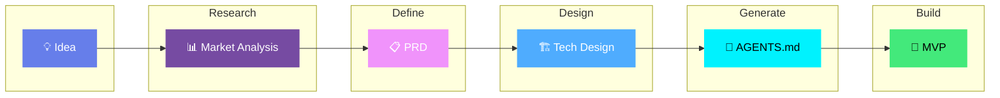

Title: Live Content

Description: Fetched live

Source: https://raw.githubusercontent.com/KhazP/vibe-coding-prompt-template/main/README.md

---

  

<h3 align="center">A practical AI workflow for shipping MVPs</h3>

  <strong>Turn an idea into an MVP with structured prompts, agent docs, and AI-assisted coding workflows.</strong>

  Used on projects like <a href="https://vibeworkflow.app">vibeworkflow.app</a>, <a href="https://moneyvisualiser.com">moneyvisualiser.com</a>, <a href="https://caglacabaoglu.com">caglacabaoglu.com</a>, and <a href="https://alpyalay.org/realdex">RealDex App</a>.

  
  
  
  

  
  
  
  
  

---

## Table of contents
- [Built with this workflow](#built-with-this-workflow)
- [Workflow overview](#workflow-overview)
- [Quick start and the 5 steps](#quick-start-and-the-5-steps)
- [Prerequisites and tools](#prerequisites-and-tools)
- [Advanced agent practices](#advanced-agent-practices)
- [Project structure and deployment](#project-structure-and-deployment)
- [Common pitfalls and troubleshooting](#common-pitfalls-and-troubleshooting)
- [Further reading](#further-reading)

---

## Built with this workflow

This repo documents the workflow behind a handful of shipped projects. The goal is simple: do the thinking upfront, hand clean context to your tools, and keep the build phase moving.

| Project | What it is |
| :-- | :-- |
| [vibeworkflow.app](https://vibeworkflow.app) | An interactive web app built around the same structured vibe-coding workflow documented here. |
| [moneyvisualiser.com](https://moneyvisualiser.com) | A money visualization website that visualized money in a 3D environment. |
| [caglacabaoglu.com](https://caglacabaoglu.com) | A production portfolio and gallery site built with the same PRD-to-agent execution approach. |
| [alpyalay.org/realdex](https://alpyalay.org/realdex) | A mobile app built on React Native that lets you catch animals, and put them in a Pokemon-like collection. |

  Maintained by <a href="https://x.com/alpyalay">Alp Yalay</a>.

---

## Workflow overview

The process moves through five stages, from idea validation to working code:

  
  

---

## Quick start and the 5 steps

> TL;DR: run research, turn it into a PRD, choose the stack, generate your agent files, then build in small passes.

### Phase 1: thinking through the product
Do the first three steps in ChatGPT, Claude.ai, Gemini, or any other chat tool. You do not need a repo yet.

###  Deep Research

<b>Check whether the idea is worth building</b> - 20-30 min

This step gives you a quick read on demand, competitors, and whether the scope looks realistic.

1. Open [`part1-deepresearch.md`](part1-deepresearch.md) and **copy all of its contents**.
2. **Paste it** into your preferred AI platform Chat (like Claude.ai, ChatGPT, or Gemini) and press **Enter**.
3. The AI will ask you a few questions about your idea. Answer them truthfully in the chat.
4. The AI will generate a comprehensive research document based on your answers.
5. **Save the output** into a local file named `research-[YourAppName].md` (or `.txt`) or simply **keep this chat open** for Step 2.

Tip: if your chat tool supports web search, turn it on so the stats and competitor references are current.

###  Product Requirements (PRD)

<b>Write down what the MVP actually needs to do</b> - 15-20 min

This turns the rough idea into a scope you can build against.

1. Copy the contents of [`part2-prd-mvp.md`](part2-prd-mvp.md).
2. **Option A (Same Chat):** If you kept your chat open, paste the prompt right below the Deep Research output.
3. **Option B (New Chat):** Start a fresh chat, paste your saved `research-[YourAppName].md` content, and then paste the Part 2 prompt below it.
4. Press Enter, answer any clarifying questions the AI asks, and let it generate your requirements.
5. **Save the final output** as `PRD-[YourAppName]-MVP.md`.

###  Technical Design

<b>Pick a stack you can actually ship with</b> - 15-20 min

This step helps you choose the stack 

